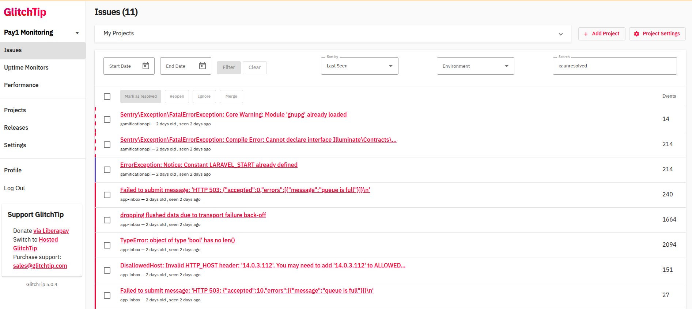

# Post-Login GlitchTip Setup Guide

This guide explains what to do after logging into the GlitchTip dashboard and how to integrate your Laravel (PHP) or Django (Python) application with GlitchTip for error monitoring.

---

## 1. Create a Project

1. Log in to your GlitchTip dashboard at `https://glitchtip.example.in`
2. Click on **Projects** in the sidebar
3. Click **Create Project**
4. Fill in the form:
   - **Name**: e.g., My Laravel App or My Django Service
   - **Platform**: Choose the relevant one (PHP, Python, etc.)
5. Click **Create Project**

📌 A **DSN URL** will be generated. Copy this — you’ll need it for integration.

---

## 2. Configure PHP (Laravel) Integration

### 2.1 Install SDK

Navigate to your project folder where Composer is installed and run:

```bash
composer require sentry/sdk
```

### 2.2 Modify `index.php`

To capture all errors (even during early boot), initialize the SDK after Composer autoload is included.  
In your `public/index.php`, add the following line **after**:

```php
require __DIR__.'/../bootstrap/autoload.php';
Sentry\init(['dsn' => 'YOUR-GLITCHTIP-DSN-HERE' ]);
```

> ✅ Always `require autoload.php` before calling `Sentry\init()`.

### 2.3 Restart PHP service

Ensure you restart your **PHP-FPM** or **Apache/Nginx+PHP** service to apply changes.

---

## 3. Configure Django Integration

### 3.1 Install SDK

```bash
pip install --upgrade sentry-sdk
```

### 3.2 Update `settings.py`

Add the following configuration:

```python
import sentry_sdk
from sentry_sdk.integrations.django import DjangoIntegration

sentry_sdk.init(
    dsn="https://<your-dsn>@glitchtip.example.in/<project_id>",
    integrations=[DjangoIntegration()],
    traces_sample_rate=1.0,
    send_default_pii=True
)
```

All unhandled errors and exceptions in Django will now be sent to your GlitchTip project.

---

## 4. Test Integration

After setup:

- **Laravel**: Trigger an exception (e.g., throw one in a route)
- **Django**: Raise an error in a view or management command

Then check your **GlitchTip dashboard** under the respective project.

   
---

🎉 You're now successfully connected to GlitchTip!